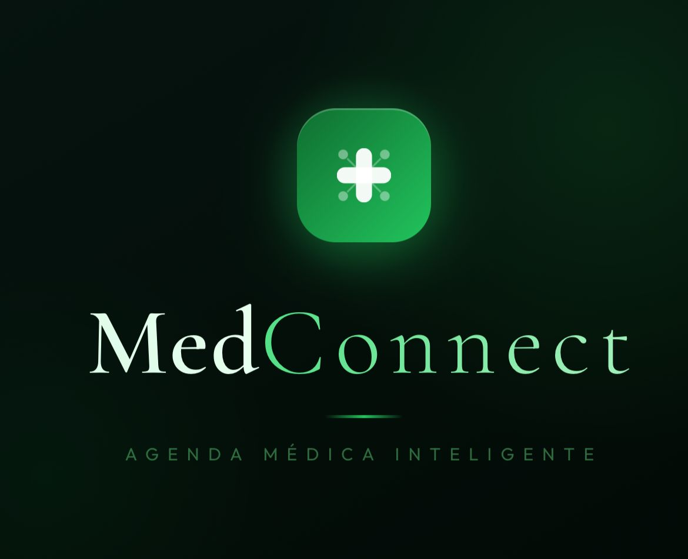

<div align="center">

# 🩺 MedConnect 

### Agenda Médica Inteligente

*"Conexão direta com o seu bem-estar!"*



</div>

---

## 📖 Sobre

Versão **Flutter/Dart** do MedConnect, projeto acadêmico do curso de
**Análise e Desenvolvimento de Sistemas (UNIVIÇOSA)**, originalmente
desenvolvido em HTML, CSS e JavaScript. Toda a identidade visual e os
fluxos do protótipo foram preservados, e evoluíram para um app real com
**backend em Firebase**: chat em tempo real, notificações, anexos de
imagem/áudio, busca de clínicas reais de Viçosa/MG e instalação via QR
Code.

## ✨ Funcionalidades

| Tela | O que faz |
| :--- | :--- |
| **Início** | Saudação dinâmica (bom dia/tarde/noite), contador real de consultas futuras, ações rápidas e card da próxima consulta com cancelamento (confirmação + Desfazer) |
| **Consultas** | Filtros Todas / Futuras / Realizadas / Canceladas, badges de status e cancelamento com **confirmação + Desfazer** |
| **Mensagens** | Chat em **tempo real** (Firestore) com **emojis**, **áudio** (gravar/tocar), **anexo de imagem**, **status de leitura** (✓ enviado / ✓✓ entregue / ✓✓ azul visto) e **notificação local** quando chega mensagem nova. Filtro Todas/Não lidas, busca por clínica, contador de não lidas |
| **Clínicas** | Busca por nome ou especialidade entre **clínicas, hospitais, laboratórios, farmácias e consultórios reais de Viçosa, MG** (dados verdadeiros, curados manualmente), com agendamento real (especialidade, data e hora) |
| **Perfil** | Menu completo; "Notificações" mostra um **badge com a contagem de não lidas** e abre as mensagens filtradas; "Sair" pede confirmação |

## 🔥 Backend (Firebase)

O app usa Firebase no **plano gratuito (Spark)** — sem custo, sem cartão de crédito:

- **Authentication** (anônimo): identifica a usuária sem precisar de tela de login.
- **Firestore**: conversas/mensagens do chat e a coleção pública de clínicas, sincronizados em tempo real.
- **Cloud Messaging / `flutter_local_notifications`**: notificação local disparada pelo próprio app ao chegar uma mensagem nova.

Duas features do roadmap original dependeriam de **Cloud Functions** e
**Firebase Storage**, que exigem o plano pago (Blaze) — para manter o
projeto 100% gratuito, foram resolvidas de outra forma:

- **Resposta automática da clínica**: simulada pelo próprio app (delay + auto-resposta), não por um servidor.
- **Anexos de imagem/áudio**: guardados no armazenamento local do aparelho (`path_provider`), só a referência fica no Firestore.

## 📱 Baixar o app (QR Code)

O APK é publicado no Firebase Hosting e pode ser baixado por qualquer
pessoa, sem convite:

**https://medconnect-r71.web.app**

A página mostra um QR Code (gerado localmente por
`tool/generate_qr_svg.dart`, sem serviço externo) que já aponta direto
para o download do `.apk`.

## 🏗️ Arquitetura

```
lib/
├── main.dart                  # Ponto de entrada: Firebase.initializeApp, login anônimo, notificações
├── app.dart                   # MaterialApp + injeção de dependências (AppScope)
├── firebase_options.dart      # Gerado pelo FlutterFire CLI
├── core/
│   ├── theme/                 # Cores (fiéis ao CSS original) e tema Material 3
│   └── utils/                 # Formatação de datas pt-BR sem dependências
├── models/                    # Appointment, Clinic, Conversation/ChatMessage (imutáveis)
├── data/                      # Dados mock (consultas) e clínicas reais curadas (clinics_seed.dart)
├── services/                  # AuthService, NotificationService, AttachmentStorage
├── repositories/              # Acesso ao Firestore (ConversationsRepository, ClinicsRepository)
├── controllers/               # Estado reativo (ChangeNotifier) + AppScope
├── screens/                   # Uma pasta por tela (home, consultas, mensagens, clínicas, perfil)
└── widgets/                   # Componentes reutilizáveis (cards, badges, banner de desfazer...)
```

Decisões de projeto:

- **Estado com `ChangeNotifier` + `ListenableBuilder`** e injeção via
  `InheritedWidget` (`AppScope`) — sem Provider/Bloc/Riverpod, mesmo
  padrão do protótipo original, agora alimentado por streams do
  Firestore em vez de listas fixas em memória.
- **Camada de repositório** (`lib/repositories/`) isola o Firestore dos
  controllers, que continuam expondo a mesma API simples de antes
  (`filtered`, `byId`, `sendMessage`, `markAsRead`...).
- **Material 3** com paleta extraída do `style.css` original
  (`--primary: #009879`, fundos, badges de status, chips lavanda etc.).
- **Modelos imutáveis** com `copyWith`, enums para status/tipo/filtros.
- **Formatação pt-BR própria** (`15 de abr. de 2026`, `Ontem`,
  `10/05/2026`), idêntica à exibida no protótipo.
- **Banner de "Desfazer" próprio** (`widgets/undo_banner.dart`, via
  `Overlay` + `Timer`) no lugar do `SnackBar` padrão do Flutter, que
  não fechava sozinho de forma confiável em alguns aparelhos.

## 📦 Principais pacotes usados

| Pacote | Para quê |
| :--- | :--- |
| `firebase_core`, `firebase_auth`, `cloud_firestore` | Backend: autenticação anônima e banco de dados em tempo real |
| `flutter_local_notifications` | Notificação local de novas mensagens |
| `emoji_picker_flutter` | Emojis no chat |
| `record`, `just_audio` | Gravar e tocar mensagens de áudio |
| `image_picker` | Foto de perfil e anexos de imagem no chat |
| `path_provider` | Armazenamento local dos anexos |
| `permission_handler` | Permissões de microfone/notificação |
| `qr_flutter`, `qr` (dev) | Geração do QR Code de instalação |
| `fake_cloud_firestore` (dev) | Testes de widget sem depender do Firebase real |

## 🚀 Como executar

Pré-requisito: [Flutter](https://docs.flutter.dev/get-started/install)
3.32 ou superior instalado.

```bash
# 1. Instale as dependências
flutter pub get

# 2. Configure o Firebase (gera lib/firebase_options.dart) —
#    exige a Firebase CLI instalada e logada (firebase login)
dart pub global activate flutterfire_cli
flutterfire configure

# 3. Execute
flutter run
```

Para rodar os testes:

```bash
flutter test
```

Para gerar e publicar o APK (Firebase Hosting):

```bash
flutter build apk --release
# copie build/app/outputs/flutter-apk/app-release.apk para public/medconnect.apk.bin
firebase deploy --only hosting
```

## 🔄 Mapa da conversão (HTML → Flutter)

| Original | Flutter |
| :--- | :--- |
| `html/index.html` | `screens/home/home_screen.dart` |
| `html/consultas.html` | `screens/appointments/appointments_screen.dart` |
| `html/mensagens.html` | `screens/messages/messages_screen.dart` (+ `chat_screen.dart`) |
| `html/clinicas.html` | `screens/clinics/clinics_screen.dart` (+ `booking_sheet.dart`) |
| `html/perfil.html` | `screens/profile/profile_screen.dart` |
| `css/style.css` (variáveis) | `core/theme/app_colors.dart` / `app_theme.dart` |
| `js/app.js` (filtros, busca, cancelamento) | `controllers/*.dart` |
| `.bottom-nav` | `NavigationBar` (Material 3) em `screens/shell/app_shell.dart` |

## 👨‍💻 Equipe

| Integrante | Função |
| :--- | :--- |
| Pedro Henrique Silva Dias | CEO |
| Henrique Lucrécio | Product Owner |
| Rayanne Fernandes | Scrum Master |
| Anthony Araújo | Desenvolvedor |
| Marina Vieira | Desenvolvedora |
| Rhayane Freitas | Desenvolvedora |
| Alice Risso | Designer |

## 📚 Informações Acadêmicas

- **Disciplina:** Design de Interação
- **Curso:** Análise e Desenvolvimento de Sistemas (ADS)
- **Instituição:** UNIVIÇOSA
- **Ano:** 2026

## 📄 Licença

Projeto desenvolvido para fins acadêmicos.
